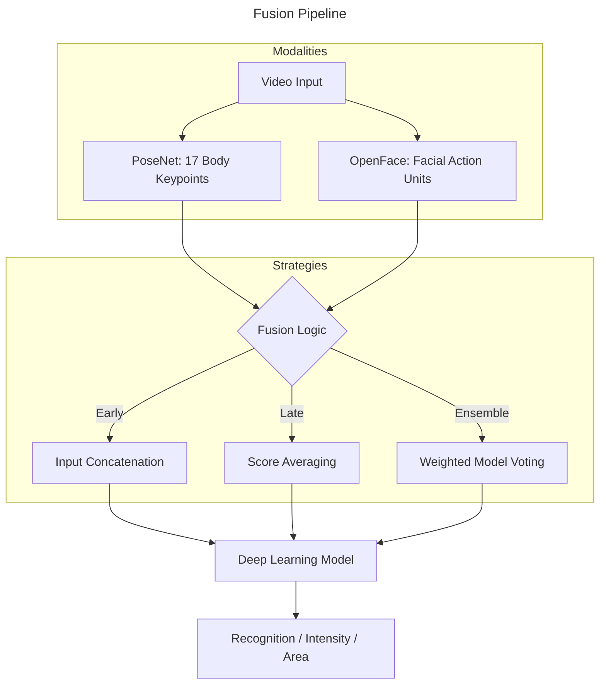

# Spot the Pain: Exploring the Application of Skeleton Pose Estimation for Automated Pain Assessment


This repository contains the code implementation for [my Master's Thesis project](https://www.diva-portal.org/smash/record.jsf%3Fpid%3Ddiva2:1673390) at Linnaeus University (2022).

The research explores how body gestures (skeleton data) can be used as a primary or complementary modality to facial expressions for objective pain recognition and localization.

**📄 [Read the full thesis (PDF)](./docs/spot_the_pain_thesis.pdf)**

---

## Abstract

Automated pain assessment is an essential part of modern healthcare and rehabilitation. While most research focuses on facial expressions, this study investigates the understudied modality of body gestures.

By using skeleton pose estimation, we modeled body movements and analyzed their impact on:

1. Pain Recognition (Detection)
2. Pain Intensity Estimation (Levels)
3. Pain Area Classification (Localization)

Through unimodal (body-only) and bimodal (body + face) approaches using **CNN-BiLSTM** and **RCNN** architectures, we demonstrated the feasibility of using skeleton data to enhance automated assessment.

## Project Organization

    ├── Makefile           <- Makefile with commands like `make data` or `make train`
    ├── README.md          <- The top-level README for developers using this project.
    ├── data
    │   ├── processed      <- The final, canonical data sets for modeling.
    │   └── raw            <- The original, immutable data dump.
    │
    ├── models             <- Trained and serialized models or script files to download models from GitHub repositories
    │
    ├── notebooks          <- Jupyter notebooks
    │
    ├── reports            <- Generated analysis as HTML, PDF, LaTeX, etc.
    │   └── architectures  <- Generated graph plots of the deep learning models
    │   └── figures        <- Generated graphics and figures to be used in reporting
    │
    ├── requirements.txt   <- The requirements file for reproducing the analysis environment, e.g.
    │                         generated with `pip freeze > requirements.txt`
    │
    ├── setup.py           <- Makes project pip installable (pip install -e .) so src can be imported
    ├── src                <- Source code for use in this project.
    │   ├── data           <- Scripts to download or generate data
    │   │   ├── make_dataset.py
    │   │   └── load_dataset.py    
    │   │
    │   ├── lib             <- External libraries used in this project
    │   │   └── DeepStack
    │   │   └── time_series_augmentation
    │   │
    │   ├── models         <- Python classes to use for training models and save to make predictions

## 🏛 System Architecture & Fusion Strategies

The project investigated how to best combine facial features (Action Units) with body keypoints.



## 🛠 Tech Stack (2022)

- **Pose Estimation**: [PoseNet](https://github.com/tensorflow/tfjs-models/tree/master/posenet) (17 keypoints + confidence scores).
- **Facial Analysis**: [OpenFace](https://github.com/cmusatyalab/openface) (Action Units for PSPI measures).
- **Architectures**: Hybrid CNN-BiLSTM and Recurrent CNN (RCNN).
- **Data Engineering**: [Cookiecutter Data Science](https://drivendata.github.io/cookiecutter-data-science/) for reproducible project structure.

### Pain Intensity Metric (PSPI)

The system aimed to approximate the Prkachin and Solomon Pain Intensity (PSPI) scale:

$$PSPI \approx AU4 + (AU6 \lor AU7) + (AU9 \lor AU10) + AU43$$

> *(Note: AU43 was omitted due to OpenFace limitations in the 2022 setup).*

## 📊 Experimental Results

The models were trained on a private dataset of video recordings featuring overhead deep squat exercises. The dataset consisted of 6-second video recordings with one person performing a overhead deep squat. The whole body and face are visible, the person looks into the camera from the front. The file ```make_dataset.py``` was run once to load the CSV file output by PoseNet and OpenFace to create the final dataset used in this project.

| Objective | Best Strategy | Metric (AUC) |
| :--- | :--- | :--- |
| Pain Recognition | Bimodal Ensemble | $0.71$ |
| Intensity Estimation | Unimodal Body (CNN-BiLSTM) | $0.75$ |
| Area Classification | Late Fusion (RCNN) | $0.75$ |

## 🚀 Reflections (2026 Perspective)

Looking back at this research four years later, the landscape of Pose Estimation and Multimodal Learning has evolved significantly. If I were to iterate on this today:

- From CNN-BiLSTM to Graph Neural Networks (GNNs): Skeleton data is inherently a graph. Today, I would use ST-GNNs (Spatio-Temporal Graph Neural Networks) to better capture the anatomical dependencies between joints.
- Transformers: I would explore Video Vision Transformers (ViT) for the bimodal fusion, using cross-attention mechanisms to let the model "decide" which modality (face or body) is more reliable for a specific frame.
- Real-time Edge Deployment: With current hardware, the PoseNet-based inference could be moved entirely to the edge (e.g., using Wasm or CoreML) for real-time clinical feedback.

---

## License & Dataset Disclaimer

This implementation code is licensed under the [MIT License](LICENSE). You are free to use, modify, and distribute the code for academic or professional purposes, provided that appropriate credit is given.

**Important:** The dataset used in this research (video recordings of overhead deep squats) is **private** and is **not included** in this repository. 

- Due to ethical constraints and privacy agreements with the participants, the raw video data and processed CSV files cannot be made public.
- This repository is provided for architectural reference and transparency regarding the models and methodologies used in the thesis.

## Changelog

**[July 2022]** – Thesis published on DiVA.

**[Feb 2026]** – Added thesis as PDF and updated README, then archived repository.

## Citation

```
@misc{gardner2022spotthepain,
  author       = {Angelica Hjelm Gardner},
  title        = {Spot the Pain: Exploring the Application of Skeleton Pose Estimation for Automated Pain Assessment},
  howpublished = {Master's Thesis, Linnaeus University},
  year         = {2022}
}
```
